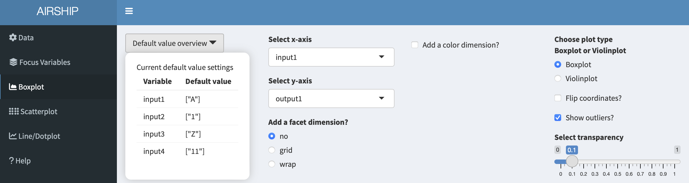

```{r, include = FALSE}
knitr::opts_chunk$set(
  collapse = TRUE,
  comment = "#>"
)
```


# Data 

For the purposes of this example, we use the included toy simulation study. In the "Data" tab, we choose the following settings:

{#id .class width=100% height=50%}

This toy example dataset has the following structure:

```{r, echo = FALSE, warning = FALSE, message = FALSE}
DT::datatable(
  head(airship::ExampleData1),
    filter = "bottom",
    class = 'cell-border stripe',
    extensions = c('Scroller', 'FixedColumns'),
    options = list(
      dom = 'Bfrtip',
      scrollX = TRUE,
      fixedColumns = TRUE,
      deferRender = TRUE,
      scrollY = 200,
      scroller = TRUE,
      fixedColumns = list(leftColumns = 1, rightColumns = 0)
    )
)
```

Two outcomes (*output1* and *output2*) were simulated using four simulation input variables (*input1-4*). The input variables take three different values each and for every unique combination of input variables, the outcomes were simulated 1000 times (*replications*) following some random mechanism.

Notice how if you scroll down, you see two datasets displayed: "Original Data" and "Summarized Data". As the dataset we used in this example contains individual simulation results, AIRSHIP automatically creates a dataset that summarizes all the outcome variables (in this case "output1" and "output2") across all levels of the input variables (if you are unsure what that means, refer to the [vignette](AIRSHIP-vignette.html)). Different plot tabs will use different datasets for plotting, e.g. the "Boxplot" and "Scatterplot" tab will use the "Original Data", whereas the "Line/Dotplot" tab will use the "Summarized Data". 

{#id .class width=100% height=50%}

# Focus Variables

For simplicity, we declare all input variables as focus variables (meaning we don't want to lump together data across several of the levels of these variables) and use the first level of each of the input variables as default values. We can do this by checking the "Use focus variables" checkbox and clicking the "Take first row as default es" button.

{#id .class width=100% height=50%}

# Boxplot

When selecting the Boxplot tab, the following figure is automatically created:

{#id .class width=100% height=50%}

The first insights this figure gives us is that for different levels of "input1", "output1" seems to be centered around the same value, however the variability is increased for when input1 equals "B" or "C". Let's remind ourselves that this is in the context of having chosen certain default values for the rest of the input variables. We can always access the specified default values in the dropdown menu "Default value overview":

{#id .class width=100% height=50%}

When playing with the "Select x-axis" dropdown menu, we can see that output1 seems to be influenced by "input2" but does not seem to differ much by "input3" or "input4". We might therefore consider going back to the "Focus Variable" tab and getting rid of the default values for "input3" and "input4", but will not do that here in this example.

In a next step, let's go back to the boxplot tab and add a color by checking the "Add a color dimension?" checkbox and selecting "input2" in the dropdown menu. Let's also flip the coordinates of the boxplot by checking the "Flip corrdinates?" checkbox:

{#id .class width=100% height=50%}

Finally, we might want to rename the axes and use a slightly different theme. If we click on "Style options", we have several options to do so:

{#id .class width=100% height=50%}

Let's download the plot and have a look at the final result:

{#id .class width=100% height=50%}

{#id .class width=100% height=50%}

# Scatterplot

Using the same dataset as in the boxplot example before, a scatterplot that shows the relationship between "output1" and "output2" by "input1", "input2" and "input3" could be constructed like this:

{#id .class width=100% height=50%}

In case we are unhappy with the automatically chosen colors, we can easily change them by ticking the "Specify your own colors?" checkbox and then clicking on the paintbrush icon:

{#id .class width=100% height=50%}

# Line/Dotplot

In this tab, we can plot the summarized data across the different levels of focus variables. It also allows us to change the linetype/shapetype depending on other variables in the dataset. In a first step, let's create the following plot:

{#id .class width=100% height=50%}

This tab allows us to plot several output variables at the same time. Notice when you add "output2_mean" in "y-axis", the color is automatically assigned to this new variables: 

{#id .class width=100% height=50%}

We can also choose to use color for factor levels similar to the "Boxplot" and "Scatterplot" tabs. In this case, only the first variable assigned to "y-axis" will be plotted:

{#id .class width=100% height=50%}


