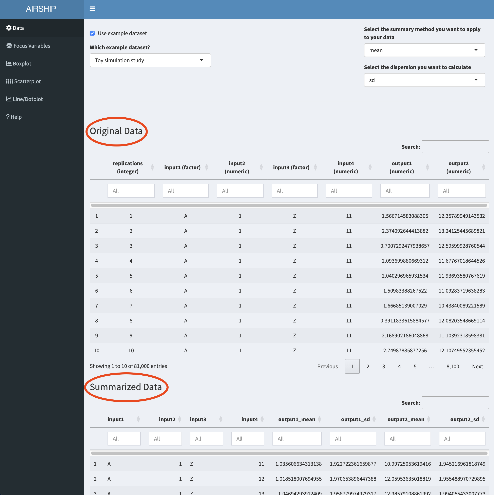

```{r, include = FALSE}
knitr::opts_chunk$set(
  collapse = TRUE,
  comment = "#>"
)
```

# Data 

For the purposes of this example, we use a dataset simulated using the powerful simulation software [FACTS](https://www.berryconsultants.com/software/facts/). When AIRSHIP is launched from within FACTS, many of the data settings are populated automatically, here we will show both the FACTS-AIRSHIP integration and the full manual process. The example dataset as well as the FACTS file can be downloaded from [Github](https://github.com/el-meyer/airship/tree/master/vignettes/Data).

## Background 

The data represents simulations from an adaptive clinical trial design, where we investigate two active treatments against a common control. Trial participants are allocated equally among all active arms. The outcome is continuous and observed after 10 weeks. After data on 150 trial participants has been observed, we conduct interim analyses for the two active treatments with the possibility to stop early for futility or efficacy. Decisions are based on t-tests, but we also calculate the corresponding posterior probabilities from an independet response model. We investigate three different sample sizes for the whole trial (300, 400, 500), three different treatment effect scenarios (both active treatments are ineffective, one is effective or both are effective) and three different recruitment rates (1, 5 or 15 trial participants enrolled per week). 

## Manual upload 

In the "Data" tab, we choose the following settings and upload the downloaded dataset:

{#id .class width=100% height=50%}

## Launch from within FACTS 

After simulating all scenarios and aggregating the data, we can select "Explore Results" and then "Compare scenarios in Airship". A console window opens that runs all the required commands and finally opens the dataset in AIRSHIP. 

{#id .class width=100% height=50%}

{#id .class width=100% height=50%}

## Data inspection 

Notice how when you scroll down, you see two datasets displayed: "Original Data" and "Summarized Data". As the dataset we used in this example contains individual simulation results (in the "Sim" column), AIRSHIP automatically creates a dataset that summarizes all the outcome variables across all levels of the input variables (if you are unsure what that means, refer to the [vignette](AIRSHIP-vignette.html)). Different plot tabs will use different datasets for plotting, e.g. the "Boxplot" and "Scatterplot" tab will use the "Original Data", whereas the "Line/Dotplot" tab will use the "Summarized Data". 

{#id .class width=100% height=50%}

# Focus Variables 

For simplicity, we declare all input variables (sample size, recruitment speed and response profiles) as focus variables (meaning we don't want to lump together data across several of the levels of these variables) and use the first level of each of the input variables as default values. We can do this by checking the "Use focus variables" checkbox and clicking the "Take first row of variants as default values" button.

{#id .class width=100% height=50%}

# Boxplot 

When selecting the Boxplot tab, a not very meaningful figure is automatically created. We want to investigate the trial duration, so we create the following plot:

{#id .class width=100% height=50%}

It becomes apparent that the recruitment speed has the greatest influence on the trial duration. For every scenario the duration has a bimodal distribution, meaning we often stopped at interim (at this point we don't yet know if we stop for efficacy or futility). 

# Scatterplot 

We will now use a scatterplot to further investigate the early stopping behavior we saw in the boxplot example before. We create the following plot:

{#id .class width=100% height=50%}

On the x-axis, we can see trial duration, on the y-axis we see the p-value of the second arm (i.e. the first of the two treatments), the different colors correspond to the different possible outcomes of the trial. Outcome 1 corresponds to early success, outcome 2 corresponds to late success, outcome 4 to early futility and outcome 7 is inconclusive, meaning we have not passed the success threshold at final. The three different columns represent the different response profiles with both treatments effective in the first column, both ineffective in the second column and one of them (treatment 2) effective in the third column. In the boxplot we were wondering about whether out early decisions are correct and this plot suggests they are.  

Let's remind ourselves that we chose certain default values for the input variables. In this case, we are plotting the results for a sample size of 300. If we wanted to see the results for a different sample size, or across all sample sizes, we could change the selection in the "Focus Variables" tab. We can always access the specified default values in the dropdown menu "Default value overview": 

{#id .class width=100% height=50%}

# Line/Dotplot

In this tab, we can plot the summarized data across the different levels of focus variables. It also allows us to change the linetype/shapetype depending on other variables in the dataset. Let's create the following plot:

{#id .class width=100% height=50%}

On the y-axis, we get the different success probabilities. In red, we see the probability that either of the two treatments is declared effective, in green we see the probability that treatment 1 is declared effective and in blue the probability that treatment 2 is declared effective. The columns represent the different response profiles similar to what we saw in the scatterplot, the x-axis corresponds to final sample size. In the third column, the green line is perfectly overlaying the red line. It appears that the success probability for the first treatment is greater in the third column than in the first column, likely because the ineffective treatment was stopped early for futility at interim and the sample size was re-allocated between control and treatment 1. 

<!-- This tab allows us to plot several output variables at the same time. Notice when you add "output2_mean" in "y-axis", the color is automatically assigned to this new variables:  -->

<!-- {#id .class width=100% height=50%} -->

<!-- We can also choose to use color for factor levels similar to the "Boxplot" and "Scatterplot" tabs. In this case, only the first variable assigned to "y-axis" will be plotted: -->

<!-- {#id .class width=100% height=50%} -->


# Per dose graphs

If we want to create graphs by dose, we firstly need to revisit the data tab and pivot longer on treatment. In this instance, we know that we had three treatments (control, active 1 and active 2). We can achieve this using these settings:

{#id .class width=100% height=50%}

Importantly, we need to let AIRSHIP finish the data processing steps (as indicated by the busy spinner in the rop right corner and the red horizontal bar in the top) before we proceed. Failure to wait might results in AIRSHIP crashing. After we are finished, we see a new column has appeared in the dataset: 

{#id .class width=100% height=50%}

Using this new column allows us to create the following graph:

{#id .class width=100% height=50%}

On the x-axis we can see trial duration, on the y-axis the observed mean respone, color codes the three arms (control in red), the columns correspond to the respone profiles and the rows to the trial outcomes (see previous scatterplot tab for an explanation). We can see that there are only few points in the first column and third row - we make very few type II errors in this case. When they happen, there is no clear separation between the observed treatment effects of the three arms. Another thing we can easily see is that in the null case most stops for early futility are a result of the observed treatment effect of the control arm being above those of the treatment arms. Both of these findings were expected, but it is still good to convince oneself that the simulations are doing the right thing.
