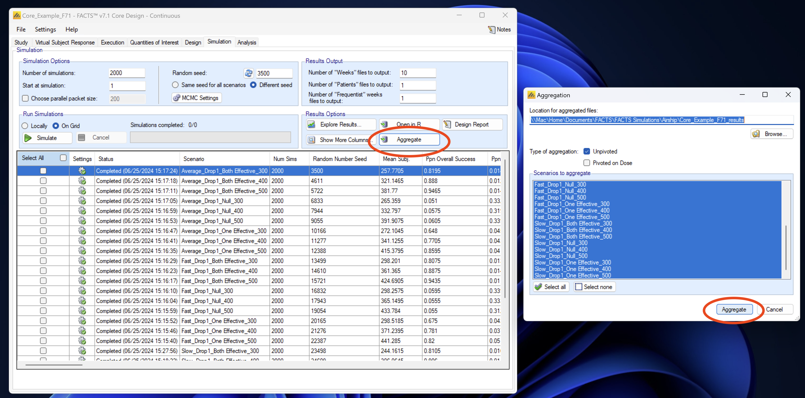
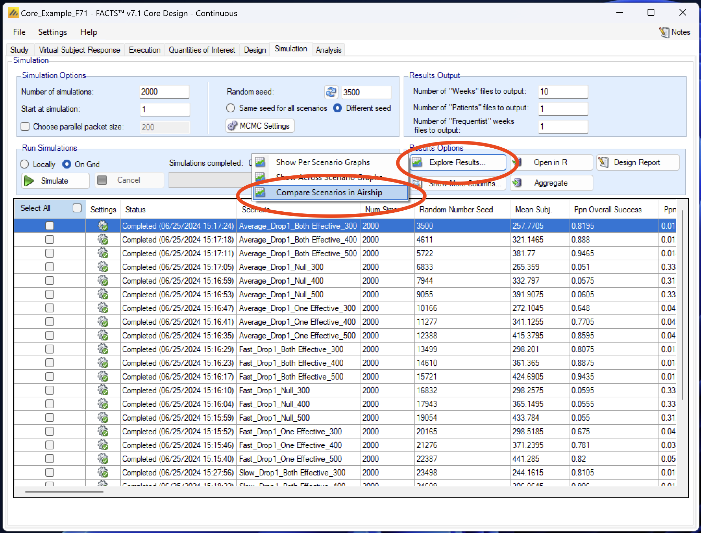
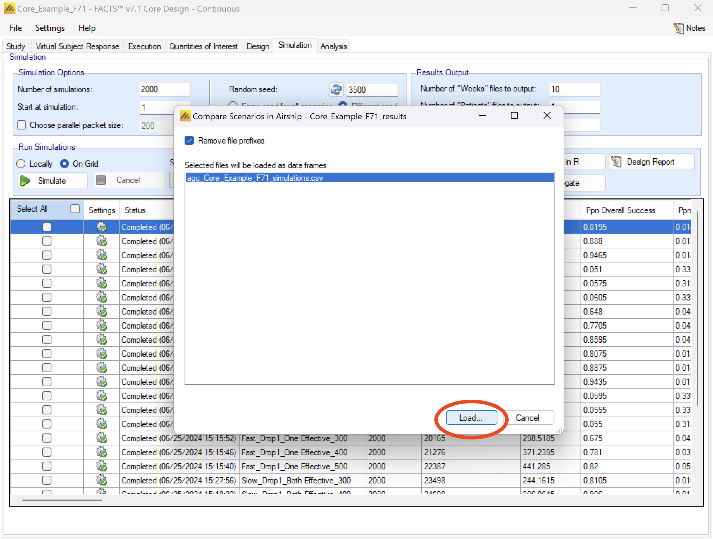
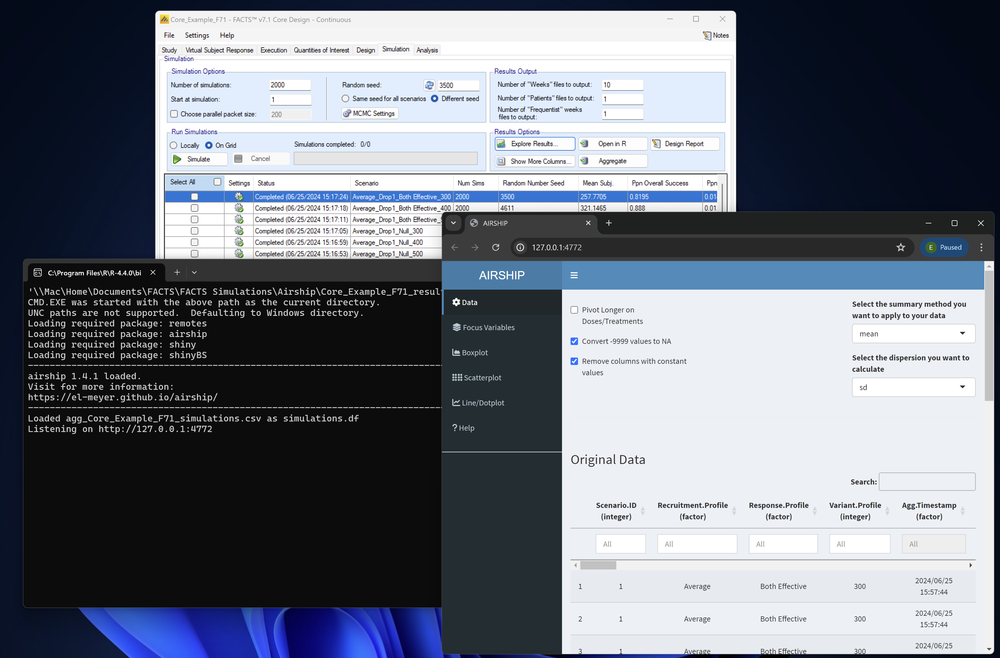

```{r, include = FALSE}
knitr::opts_chunk$set(
  collapse = TRUE,
  comment = "#>"
)
```

# General

If you have a FACTS design with more than one scenario (or design variant), you may want to use AIRSHIP to compare the scenarios (or design variants). AIRSHIP uses the aggregated simulation file, so in a first step you need to aggregate the simulation results:

{#id .class width=100% height=50%}

After aggregation, you can select "Explore Results" and then "Compare Scenarios in Airship".

{#id .class width=100% height=50%}

FACTS will prompt you to choose an aggregated simulation file. Select the one you created previously and clock "Load".

{#id .class width=100% height=50%}

FACTS will now open a Powershell terminal and run the required commands to run AIRSHIP and load the selected dataset. If this is your first time running AIRSHIP, you might have to install AIRSHIP, which should be done automatically, but might take a few minutes. If the terminal closes without opening AIRSHIP or errors, see the Troubleshooting section for more information. 

{#id .class width=100% height=50%}

Looking for more information on how to use AIRSHIP? Check out our examples that guide you through the usage and features step-by-step. You should start with [Example 1](https://el-meyer.github.io/airship/articles/Example1.html) and then go on to [Example 2](https://el-meyer.github.io/airship/articles/Example2.html), which is dedicated to FACTS data.


# Troubleshooting {#troubleshooting}

The easiest way to proceed if you have any issues with the AIRSHIP installation through the terminal is to open an instance of RGui (not R Studio) and try to install AIRSHIP manually using either

``` r
install.packages("airship")
```

to get the latest stable version from CRAN, or

``` r
# install.packages("devtools")
devtools::install_github("el-meyer/airship@*release")
```

to get the latest stable version from Github. 

We are aware of the following issues:

-) Some machines, especially ARM based Windows machines, require installation of [Rtools](https://cran.r-project.org/bin/windows/Rtools/) prior to being able to install AIRSHIP. Make sure to install the correct version for your machine (i.e. if you are running an ARM machine, install the ARM version of Rtools). Failure to install Rtools might results in an uninformative lazy-loading error when trying to install AIRSHIP.

-) Make sure to install the R version that is correct for your machine (i.e. if you are running an ARM machine, install [R for ARM](https://www.r-project.org/nosvn/winutf8/aarch64/R-4/)). 

-) ARM Windows machines are not fully compatible with RStudio. Make sure to install AIRSHIP using the terminal or through RGui. 

-) Some machines have permission errors when installing new R packages. You can easily test this by opening RGui and trying to install any packages from CRAN. If you get a permission error, the folder that is selected for package installation is not writeable. Often this is automatically solved by downloading and installing RStudio and installing any package from CRAN through RStudio.

-) Sometimes, a lazy-load error appears related to some dependency not being installed properly. Try to re-install the dependency using RGui or RStudio; restarting your machine might also help. This is a common R issue. 

If you have troubles installing AIRSHIP and none of these solutions worked for you, please reach out to facts@berryconsultants.net, we are happy to help you.
